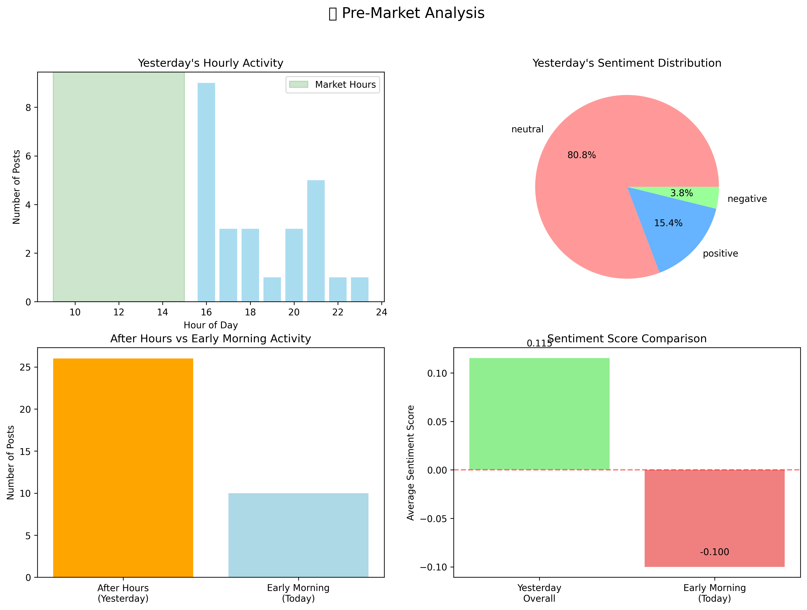
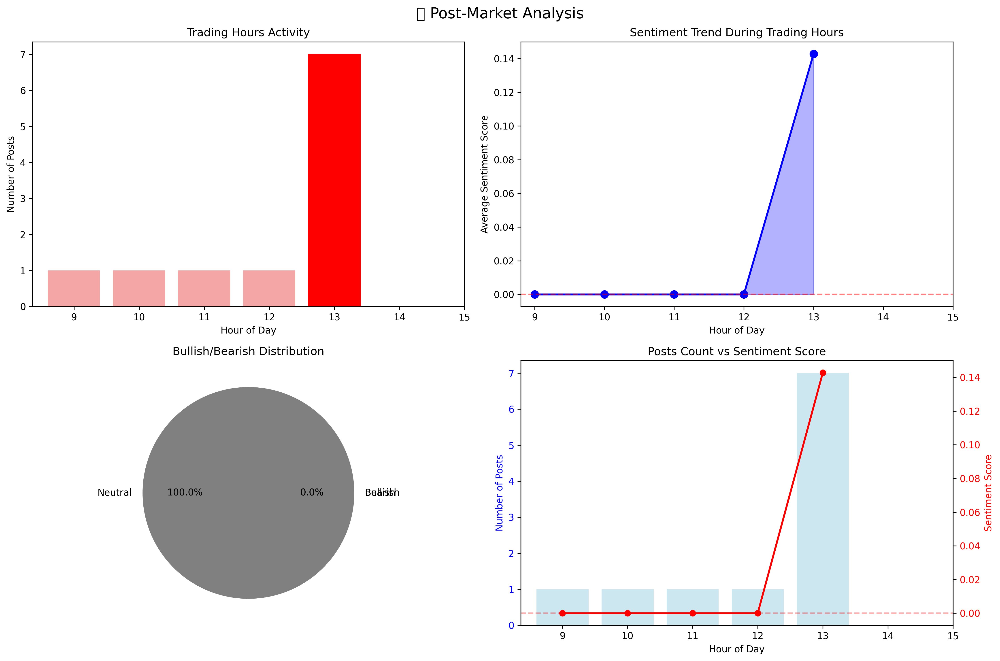
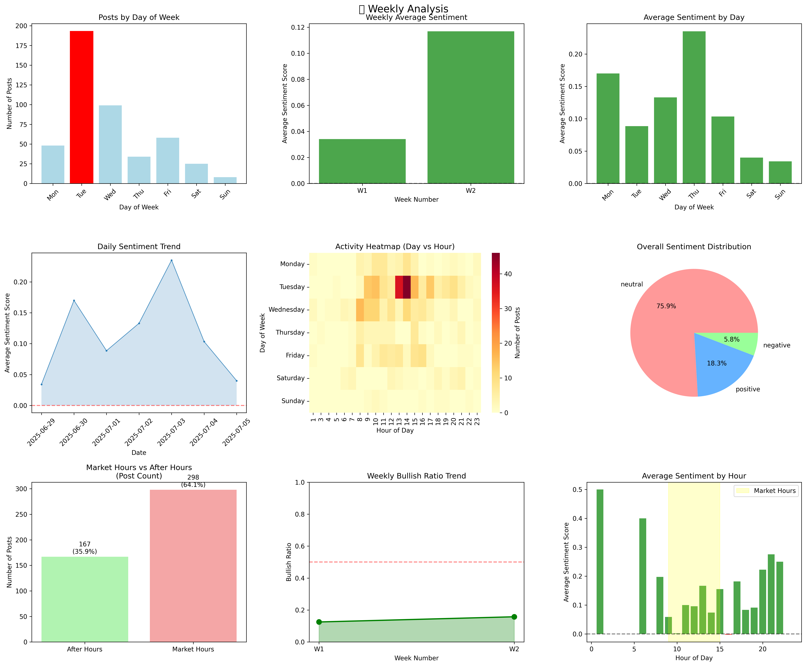
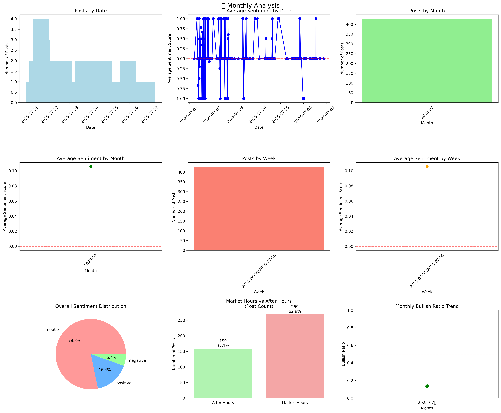
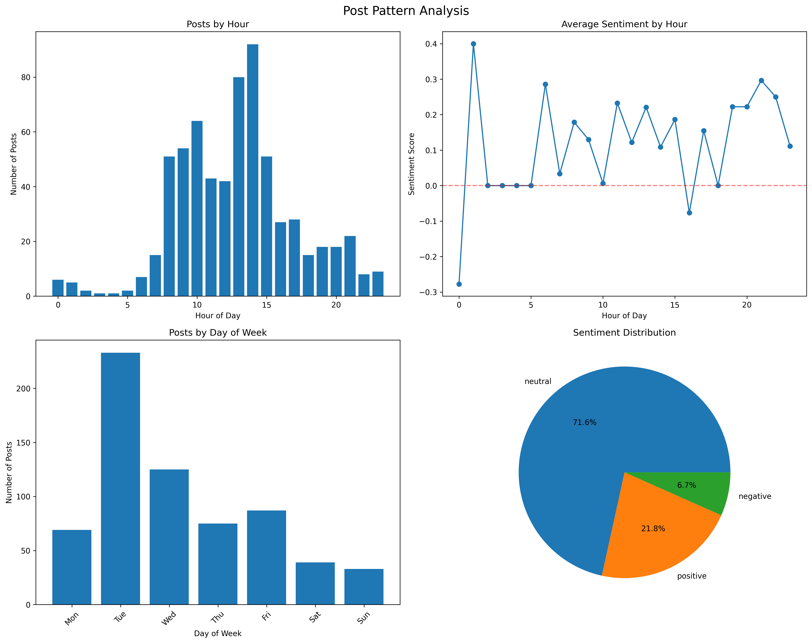

# 📈 Stock Sentiment Analysis Reports

*Last Updated: 2025-11-14 08:35*

주식 게시글 감정 분석 및 패턴 분석 리포트

## 📅 보고서 갱신 현황

| 보고서 타입 | 최근 갱신일 | 상태 |
|------------|------------|------|
| 🌅 장시작 전 리포트 | 2025-11-14 | ✅ 최신 |
| 🌆 장마감 후 리포트 | 2025-11-13 | ✅ 최신 |
| 📅 주간 리포트 | 2025-11-09 | ✅ 최신 |
| 📆 월간 리포트 | 2025-11-01 | ✅ 최신 |
| 📊 종합 패턴 분석 | 2025-07-20 | ✅ 최신 |

---

## 🌅 장시작 전 리포트 (Pre-Market Analysis)
*전일 활동 분석 및 새벽 시간대 감정 변화*

---

## 🌆 장마감 후 리포트 (Post-Market Analysis)
*당일 장시간 활동 분석 및 감정 트렌드*

---

## 📅 주간 리포트 (Weekly Analysis)
*지난 7일 종합 분석 및 요일별 패턴*

---

## 📆 월간 리포트 (Monthly Analysis)
*월간 종합 분석 및 트렌드*

---

## 📊 종합 패턴 분석 (Pattern Analysis)
*시간대별/요일별 활동 패턴*

---

## 📋 리포트 설명

| 리포트 타입 | 생성 주기 | 주요 내용 |
|------------|----------|-----------|
| 🌅 장시작 전 | 매일 아침 | 전일 활동, 새벽 감정 변화, 장외시간 분석 |
| 🌆 장마감 후 | 매일 저녁 | 당일 장시간 활동, 시간대별 감정 트렌드 |
| 📅 주간 | 매주 일요일 | 7일 종합 분석, 요일별 패턴 |
| 📆 월간 | 매월 1일 | 월간 트렌드, 감정 변동성 분석 |
| 📊 패턴 분석 | 요청 시 | 시간대/요일별 활동 패턴 종합 |

---

